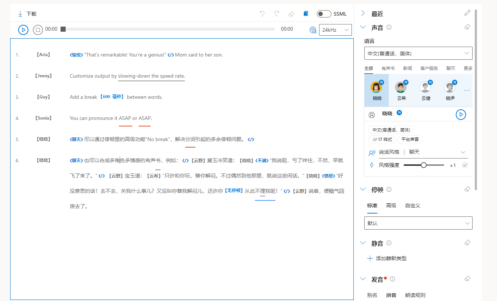

# App02.TTS

Text-To-Speech 是 [Speech Studio](https://speech.microsoft.com/portal/) 中的一项服务，可以将文字转换为语音。

## [Azure AI | Text-To-Speech](https://speech.microsoft.com/portal/a5c0530142b649c785a9a50be27b127d/voicegallery)

> 构建自然说话的应用和服务，从 147 种语言和变体中选择 456 种语音。借助高表现力和类似人类的神经语音，让你的方案生动起来。

## 创建最佳音频的步骤


- 在 go.microsoft.com 创建语音订阅
- 新建调音文件或上传你的文本。
- 选择语言和声音
- 定制并优化语音输出。
- 下载音频或获取 SSML 代码，以嵌入到应用程序中。

### 定制并优化语音输出

微软提供了[精简版有声内容创作](https://speech.microsoft.com/audiocontentcreation) 试用。



#### SSML - Style and degree example

```xml
<speak version="1.0" xmlns="http://www.w3.org/2001/10/synthesis"
       xmlns:mstts="https://www.w3.org/2001/mstts" xml:lang="zh-CN">
    <voice name="zh-CN-XiaomoNeural">
        女儿看见父亲走了进来，问道：
        <mstts:express-as role="YoungAdultFemale" style="calm">
            “您来的挺快的，怎么过来的？”
        </mstts:express-as>
        父亲放下手提包，说：
        <mstts:express-as role="OlderAdultMale" style="calm">
            “刚打车过来的，路上还挺顺畅。”
        </mstts:express-as>
    </voice>
</speak>
```

#### Use SSML to customize speech characteristics

```c#
using Microsoft.CognitiveServices.Speech;

class Program 
{
    // This example requires environment variables named "SPEECH_KEY" and "SPEECH_REGION"
    static string speechKey = Environment.GetEnvironmentVariable("SPEECH_KEY");
    static string speechRegion = Environment.GetEnvironmentVariable("SPEECH_REGION");

    async static Task Main(string[] args)
    {
        var speechConfig = SpeechConfig.FromSubscription(speechKey, speechRegion);
         
        var speechSynthesisVoiceName  = "en-US-JennyNeural";  
        var ssml = @$"<speak version='1.0' xml:lang='en-US' xmlns='http://www.w3.org/2001/10/synthesis' xmlns:mstts='http://www.w3.org/2001/mstts'>
            <voice name='{speechSynthesisVoiceName}'>
                <mstts:viseme type='redlips_front'/>
                The rainbow has seven colors: <bookmark mark='colors_list_begin'/>Red, orange, yellow, green, blue, indigo, and violet.<bookmark mark='colors_list_end'/>.
            </voice>
        </speak>";

        // Required for sentence-level WordBoundary events
        speechConfig.SetProperty(PropertyId.SpeechServiceResponse_RequestSentenceBoundary, "true");
        
        using (var speechSynthesizer = new SpeechSynthesizer(speechConfig))
        {
            // Subscribe to events

            speechSynthesizer.BookmarkReached += (s, e) =>
            {
                Console.WriteLine($"BookmarkReached event:" +
                    $"\r\n\tAudioOffset: {(e.AudioOffset + 5000) / 10000}ms" +
                    $"\r\n\tText: \"{e.Text}\".");
            };

            speechSynthesizer.SynthesisCanceled += (s, e) =>
            {
                Console.WriteLine("SynthesisCanceled event");
            };

            speechSynthesizer.SynthesisCompleted += (s, e) =>
            {                
                Console.WriteLine($"SynthesisCompleted event:" +
                    $"\r\n\tAudioData: {e.Result.AudioData.Length} bytes" +
                    $"\r\n\tAudioDuration: {e.Result.AudioDuration}");
            };

            speechSynthesizer.SynthesisStarted += (s, e) =>
            {
                Console.WriteLine("SynthesisStarted event");
            };

            speechSynthesizer.Synthesizing += (s, e) =>
            {
                Console.WriteLine($"Synthesizing event:" +
                    $"\r\n\tAudioData: {e.Result.AudioData.Length} bytes");
            };

            speechSynthesizer.VisemeReceived += (s, e) =>
            {
                Console.WriteLine($"VisemeReceived event:" +
                    $"\r\n\tAudioOffset: {(e.AudioOffset + 5000) / 10000}ms" +
                    $"\r\n\tVisemeId: {e.VisemeId}");
            };

            speechSynthesizer.WordBoundary += (s, e) =>
            {
                Console.WriteLine($"WordBoundary event:" +
                    // Word, Punctuation, or Sentence
                    $"\r\n\tBoundaryType: {e.BoundaryType}" +
                    $"\r\n\tAudioOffset: {(e.AudioOffset + 5000) / 10000}ms" +
                    $"\r\n\tDuration: {e.Duration}" +
                    $"\r\n\tText: \"{e.Text}\"" +
                    $"\r\n\tTextOffset: {e.TextOffset}" +
                    $"\r\n\tWordLength: {e.WordLength}");
            };

            // Synthesize the SSML
            Console.WriteLine($"SSML to synthesize: \r\n{ssml}");
            var speechSynthesisResult = await speechSynthesizer.SpeakSsmlAsync(ssml);

            // Output the results
            switch (speechSynthesisResult.Reason)
            {
                case ResultReason.SynthesizingAudioCompleted:
                    Console.WriteLine("SynthesizingAudioCompleted result");
                    break;
                case ResultReason.Canceled:
                    var cancellation = SpeechSynthesisCancellationDetails.FromResult(speechSynthesisResult);
                    Console.WriteLine($"CANCELED: Reason={cancellation.Reason}");

                    if (cancellation.Reason == CancellationReason.Error)
                    {
                        Console.WriteLine($"CANCELED: ErrorCode={cancellation.ErrorCode}");
                        Console.WriteLine($"CANCELED: ErrorDetails=[{cancellation.ErrorDetails}]");
                        Console.WriteLine($"CANCELED: Did you set the speech resource key and region values?");
                    }
                    break;
                default:
                    break;
            }
        }

        Console.WriteLine("Press any key to exit...");
        Console.ReadKey();
    }
}
```

#### Synthesize speech to a file

- Method 1: Synthesize speech to a file

```c#
    // Synthesize speech to a file
    using var audioConfig = AudioConfig.FromWavFileOutput("path/to/write/file.wav");
    using (var speechSynthesizer = new SpeechSynthesizer(speechConfig, audioConfig))
```

- Method 2: Get a result as an in-memory stream

```c#
    var result = await speechSynthesizer.SpeakTextAsync("I'm excited to try text to speech");
    using var stream = AudioDataStream.FromResult(result);
    await stream.SaveToWaveFileAsync("path/to/write/file.wav");
```