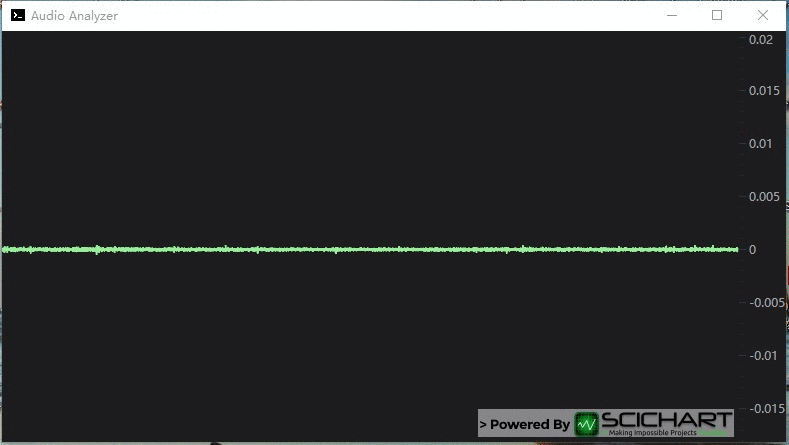

# App19.SciChart

### STEP 0 Login to your account

### STEP 1 Download the Examples

官方SDK也是Demo, 可以导出功能为独立的工程

### STEP 2 Start a trial

没有试用 **License Key** , 连效果都看不到...

### STEP 3 Run the Examples

The tutorial source code is also available on Github
under [github.com/abtsoftware/scichart.wpf.examples](https://github.com/abtsoftware/scichart.wpf.examples) -> [tutorials](https://github.com/ABTSoftware/SciChart.Wpf.Examples/tree/SciChart_v6_Release/Tutorials).

### 效果图

