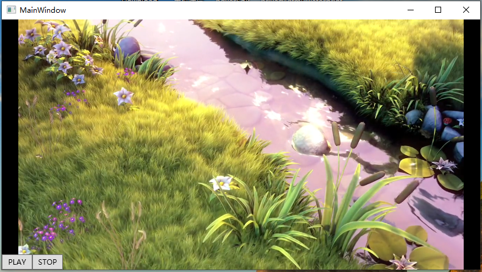

## WpfApp1

### 播放效果

### LibVLCSharp

[LibVLCSharp](https://code.videolan.org/videolan/LibVLCSharp/) is a cross-platform audio and video API for .NET
platforms based on VideoLAN's LibVLC Library. It provides a comprehensive multimedia API that can be used across mobile,
server and desktop to render video and output audio as well as encode and stream.

## Features

Check out [libvlc-nuget](https://code.videolan.org/videolan/libvlc-nuget) to get a basic understanding of how `libvlc`
works, what it can offer and how to install it with NuGet.

Some of the [features](https://www.videolan.org/vlc/features.html) include:

- Play every media file formats, every codec and every streaming protocols
- Run on every platform, from desktop (Windows, Linux, Mac) to mobile (Android, iOS) and TVs
- Hardware and efficient decoding on every platform, up to 8K
- Network browsing for distant filesystems (SMB, FTP, SFTP, NFS...) and servers (UPnP, DLNA)
- Playback of Audio CD, DVD and Bluray with menu navigation
- Support for HDR, including tonemapping for SDR streams
- Audio passthrough with SPDIF and HDMI, including for Audio HD codecs, like DD+, TrueHD or DTS-HD
- Support for video and audio filters
- Support for 360 video and 3D audio playback, including Ambisonics
- Able to cast and stream to distant renderers, like Chromecast and UPnP renderers.

Most things you can achieve with the regular VLC desktop app, you can also achieve using `libvlc`.