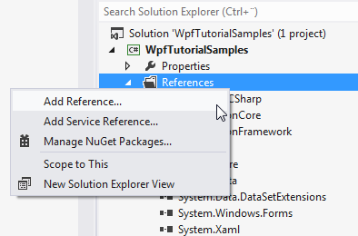
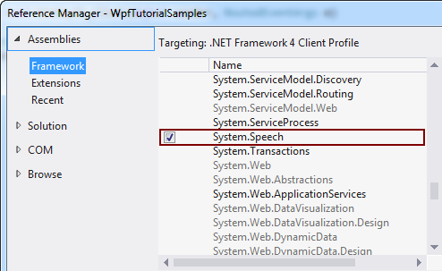
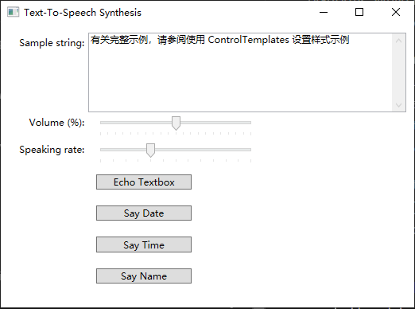

## [Text-To-Speech Synthesis in .NET](https://docs.microsoft.com/en-us/archive/msdn-magazine/2019/june/speech-text-to-speech-synthesis-in-net)

> 微软官方的System.Speech目前还无法在.net5以上的目标框架使用。

### 演示效果

